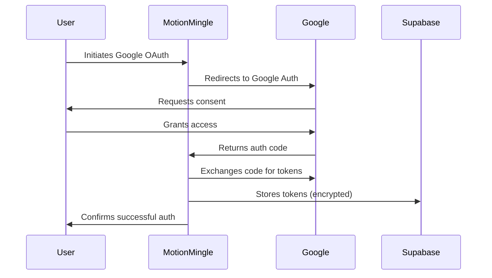

# Google Calendar Integration for MotionMingle

## Overview

This document outlines the implementation approach for integrating Google Calendar with MotionMingle, using the [Google Calendar MCP repository](https://github.com/nspady/google-calendar-mcp) as a **reference architecture**. The goal is to **build a custom calendar system** for MotionMingle that supports bidirectional synchronization with Google Calendar, while leveraging the patterns and methods demonstrated in the MCP repository.

### Key Clarifications:
1. **Not a Direct Integration**: The MCP repository serves as a guide for best practices, not as a direct dependency.
2. **Custom Implementation**: MotionMingle will implement its own calendar system, tailored to its specific needs.
3. **Bidirectional Sync**: The focus is on seamless synchronization between MotionMingle and Google Calendar.

## Table of Contents

1. [Reference Architecture](#reference-architecture)
2. [Implementation Approach](#implementation-approach)
3. [Key Components](#key-components)
4. [OAuth Authentication Flow](#oauth-authentication-flow)
5. [Calendar Sync Implementation](#calendar-sync-implementation)
6. [Testing Strategy](#testing-strategy)
7. [Resources](#resources)

## Reference Architecture

The Google Calendar MCP repository demonstrates:
1. **OAuth Flow**: Secure authentication with Google Calendar.
2. **Event Synchronization**: Handling of recurring events, conflicts, and real-time updates.
3. **API Usage**: Efficient use of Google Calendar API endpoints.

MotionMingle will **adapt these patterns** to its own architecture, ensuring compatibility with its existing Supabase backend and React frontend.

## Implementation Approach

### 1. OAuth Authentication
- Use Google OAuth for secure calendar access.
- Store tokens in Supabase with Row Level Security (RLS).
- Implement token refresh mechanisms.

### 2. Event Synchronization
- **Google → MotionMingle**: Fetch and map Google Calendar events to MotionMingle's schema.
- **MotionMingle → Google**: Push events created in MotionMingle to Google Calendar.
- Handle edge cases (e.g., recurring events, conflicts).

### 3. UI Components
- **Authentication**: Login button and status indicator.
- **Sync Controls**: Manual/automatic sync triggers.
- **Event Display**: Unified view of MotionMingle and Google Calendar events.

## Key Components

1. **Supabase Backend**:
   - Token storage and refresh.
   - Event mapping and conflict resolution.

2. **React Frontend**:
   - OAuth flow implementation.
   - Sync status UI.
   - Event display components.

3. **Google Calendar API**:
   - Event CRUD operations.
   - Recurring event handling.

## OAuth Authentication Flow

## Calendar Sync Implementation

### Sync Logic:
1. **Initial Sync**: Full event import/export.
2. **Incremental Sync**: Detect and sync changes since last sync.
3. **Conflict Resolution**: Prefer user-specified rules (e.g., "always keep MotionMingle changes").

### Edge Cases:
- Recurring event modifications.
- Deleted events.
- Timezone mismatches.

## Testing Strategy

1. **Unit Tests**:
   - Token refresh logic.
   - Event mapping utilities.

2. **Integration Tests**:
   - OAuth flow.
   - Sync triggers.

3. **End-to-End Tests**:
   - Full sync cycle.
   - Conflict resolution scenarios.

## Resources

- [Google Calendar API Docs](https://developers.google.com/calendar/api)
- [Supabase Auth Guide](https://supabase.com/docs/guides/auth)
- [MCP Repository](https://github.com/nspady/google-calendar-mcp) (Reference Only) 