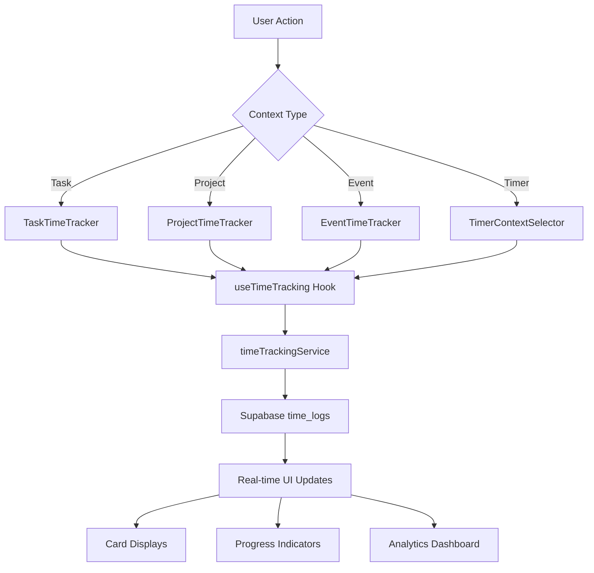

# Time Tracking Implementation Documentation

## Table of Contents
1. [Overview](#overview)
2. [Database Schema](#database-schema)
3. [Backend Architecture](#backend-architecture)
4. [Frontend Components](#frontend-components)
5. [Integration Points](#integration-points)
6. [Data Flow](#data-flow)
7. [Key Issues Identified](#key-issues-identified)
8. [Implementation History](#implementation-history)
9. [Future Improvements](#future-improvements)

## Overview

This document provides comprehensive documentation for the time tracking feature implementation in MotionMingle. The system integrates time tracking across tasks, events, projects, and a Pomodoro timer to provide a unified productivity tracking experience.

### Core Features
- **Manual time tracking** for tasks, events, and projects
- **Pomodoro timer integration** with context selection
- **Real-time time display** on all relevant cards/components
- **Progress tracking** against estimated time
- **Analytics and insights** dashboard
- **Session type categorization** (work, break, meeting, planning)
- **Multiple timer modes** (manual, pomodoro, continuous)

## Database Schema

### Time Logs Table (`time_logs`)
The central table for all time tracking data:

```sql
CREATE TABLE time_logs (
  id uuid PRIMARY KEY DEFAULT gen_random_uuid(),
  user_id uuid NOT NULL REFERENCES auth.users(id),
  task_id uuid REFERENCES tasks(id),
  event_id uuid REFERENCES events(id), 
  project_id uuid REFERENCES projects(id),
  start_time timestamp with time zone NOT NULL,
  end_time timestamp with time zone,
  duration_seconds integer,
  description text,
  session_type text DEFAULT 'work' CHECK (session_type IN ('work', 'break', 'meeting', 'planning')),
  timer_mode text DEFAULT 'manual' CHECK (timer_mode IN ('manual', 'pomodoro', 'continuous')),
  status text DEFAULT 'active' CHECK (status IN ('active', 'paused', 'completed', 'cancelled')),
  created_at timestamp with time zone DEFAULT now(),
  updated_at timestamp with time zone DEFAULT now()
);
```

### Related Table Updates

#### Tasks Table
- `estimated_time_minutes`: Estimated time for task completion
- `total_time_logged_minutes`: Cumulative logged time (updated via triggers/functions)

#### Projects Table  
- `estimated_time_hours`: Total estimated project time
- `total_time_logged_hours`: Cumulative logged time across all project activities

#### Events Table
- `actual_duration_minutes`: Actual time spent vs scheduled duration

## Backend Architecture

### Core Service: `timeTrackingService.ts`

Located at: `src/backend/api/services/timeTracking/timeTrackingService.ts`

#### Key Functions

**Session Management:**
- `startTimeTracking(params)`: Start new tracking session
- `stopTimeTracking()`: Complete active session
- `pauseTimeTracking()`: Pause active session  
- `resumeTimeTracking()`: Resume paused session
- `cancelTimeTracking()`: Cancel and delete active session
- `getActiveTimeLog()`: Get current active session

**Data Retrieval:**
- `getTimeLogs(filters?)`: Get filtered time logs
- `getTimeStats(filters?)`: Get aggregated statistics
- `getProjectTimeLogs(projectId)`: Get project-specific logs
- `getTaskTimeLogs(taskId)`: Get task-specific logs
- `getEventTimeLogs(eventId)`: Get event-specific logs

**Analytics:**
- `getProjectTimeStats(projectId)`: Project time statistics
- `getTimeAnalyticsByType(days)`: Breakdown by session type
- `getProductivityInsights()`: Dashboard insights

**Utility Functions:**
- `formatDuration(seconds)`: Human-readable time formatting
- `calculateElapsedTime(startTime)`: Real-time duration calculation

### Timer Integration Service: `timerIntegrationService.ts`

Bridges Pomodoro timer with time tracking:
- `startTimerSession(session)`: Start timer with tracking context
- `completeTimerSession()`: Complete timer and save log
- `getCurrentTimerSession()`: Get active timer session

### Service Architecture Patterns

#### MCP Pattern Compliance
All time tracking services follow the Model-Controller-Persistence pattern:
```typescript
// Authentication check
const { data: { user } } = await supabase.auth.getUser();
if (!user) throw new Error("User not authenticated");

// Database operation with user filtering
const { data, error } = await supabase
  .from("time_logs")
  .select("*")
  .eq('user_id', user.id);

// Error handling
if (error) throw error;
return data;
```

## Frontend Components

### Core Hook: `useTimeTracking`

Located at: `src/frontend/hooks/useTimeTracking.ts`

Provides centralized state management for time tracking:

```typescript
interface UseTimeTrackingReturn {
  // State
  activeTimeLog: TimeLog | null;
  isActive: boolean;
  isLoading: boolean;
  timeStats: TimeStats | null;
  formattedElapsedTime: string;
  
  // Actions
  startTracking: (params) => Promise<void>;
  stopTracking: () => Promise<void>;
  pauseTracking: () => Promise<void>;
  resumeTracking: () => Promise<void>;
  cancelTracking: () => Promise<void>;
  refreshStats: () => Promise<void>;
}
```

### Component Integration

#### 1. TaskCard Enhancement (`TaskCard.tsx`)
- **TaskTimeTracker component**: Compact time display
- **Features**: Progress indicators, start/stop buttons, logged time display
- **Location**: `src/frontend/features/tasks/components/TaskTimeTracker.tsx`

#### 2. EventItem Integration (`EventItem.tsx`)  
- **EventTimeTracker component**: Event-specific tracking
- **Features**: Auto-start based on event timing, meeting session types
- **Location**: `src/frontend/features/calendar/components/EventTimeTracker.tsx`

#### 3. ProjectCard Enhancement (`ProjectCard.tsx`)
- **ProjectTimeTracker component**: Project time statistics
- **Features**: Total time, session counts, progress vs estimates
- **Location**: `src/frontend/features/project/components/ProjectTimeTracker.tsx`

#### 4. Timer Page Integration (`Timer.tsx`)
- **TimerContextSelector**: Context selection for tracking
- **Features**: Task/project/event selection, custom sessions
- **Location**: `src/frontend/features/timer/components/TimerContextSelector.tsx`

### UI Components Created

#### Progress Component (`progress.tsx`)
Radix UI progress component for visual progress indicators:
```typescript
interface ProgressProps {
  value?: number;
  className?: string;
}
```

#### Sheet Component (`sheet.tsx`)  
Modal overlay component using Radix UI Dialog for context selection.

#### Command Component (`command.tsx`)
Command palette component using cmdk for searchable context selection.

## Integration Points

### 1. Pomodoro Timer Integration

**Timer Flow:**
```
User starts timer → Selects context → Timer runs → Time tracked → Data saved
```

**Context Selection:**
- Active tasks (not completed/archived)
- Active projects  
- Today's events
- Custom sessions with descriptions

**State Management:**
```typescript
// Timer context state
interface TimerContext {
  type: 'task' | 'project' | 'event' | 'custom';
  id?: string;
  name: string;
  description?: string;
}
```

### 2. Task Integration

**Real-time Updates:**
- Time display on task cards
- Progress indicators 
- Start/stop buttons
- Estimated vs actual time comparison

**Data Synchronization:**
- Time logs linked via `task_id`
- `total_time_logged_minutes` updated after each session
- Progress calculations for time-based completion

### 3. Project Integration

**Comprehensive Statistics:**
- Total time across all project activities
- Session counts and averages
- Weekly time breakdowns
- Progress against estimated hours

**Multi-level Tracking:**
- Direct project time tracking
- Indirect via project tasks
- Project events (meetings, planning)

### 4. Event Integration

**Meeting Time Tracking:**
- Actual vs scheduled duration
- Meeting session type categorization
- Auto-start suggestions based on event timing
- Google Calendar integration compatibility

## Data Flow

### Complete Time Tracking Flow



### Session Lifecycle

```
1. START: User initiates tracking
   ↓
2. ACTIVE: Session running, real-time updates
   ↓
3. PAUSE (optional): Temporarily stop
   ↓ 
4. RESUME (optional): Continue session
   ↓
5. STOP: Complete session, calculate duration
   ↓
6. SAVE: Store to database, update totals
   ↓
7. REFRESH: Update UI with new data
```

## Key Issues Identified

### 1. Schema Field Naming Inconsistency

**Issue**: Database vs TypeScript interface mismatch
- Database: `estimated_time_hours`, `total_time_logged_hours`
- TypeScript interfaces: Various naming patterns

**Resolution Needed**: Standardize field names across schema and types.

### 2. Time Display Terminology

**Current Issue**: ProjectTimeTracker shows total time but may be unclear
**Suggestion**: Display as "Time Spent" for clarity

**Files to Update:**
- `src/frontend/features/project/components/ProjectTimeTracker.tsx` (lines ~155-165)
- Compact mode display labels

### 3. Progress Calculation Accuracy

**Issue**: Progress percentages may not align with actual vs estimated time
**Current**: Uses session count vs estimated hours
**Should**: Use actual minutes vs estimated minutes for accuracy

### 4. Missing UI Components

**Resolved**: Created missing Radix UI components:
- Progress component for visual indicators
- Sheet component for modal overlays  
- Command component for searchable selection

### 5. Import Path Inconsistencies

**Issue**: Mix of `fetchTasks`/`getTasks` function names
**Resolution**: Standardized to service-based naming (`getTasks`, `getProjects`)

## Implementation History

### Phase 1: Core Integration (Completed)
**Timeline**: Initial implementation
**Scope**: Basic time tracking integration across components

**Implemented:**
- ✅ TaskTimeTracker component with progress indicators
- ✅ EventTimeTracker with auto-start functionality  
- ✅ ProjectTimeTracker with comprehensive statistics
- ✅ Fixed schema property naming inconsistencies
- ✅ Created missing UI components (Progress, Sheet, Command)

### Phase 2: Enhanced Timer Integration (Completed)
**Timeline**: Timer context selection implementation
**Scope**: Pomodoro timer integration with context selection

**Implemented:**  
- ✅ TimerContextSelector with search and filtering
- ✅ Context persistence and state management
- ✅ Integration with existing timer state management
- ✅ Enhanced startTracking with context data

### Phase 3: Advanced Analytics (Completed)
**Timeline**: Analytics and reporting features
**Scope**: Comprehensive time analytics and insights

**Implemented:**
- ✅ Enhanced timeTrackingService with specialized functions
- ✅ Session type analytics (`getTimeAnalyticsByType`)
- ✅ Productivity insights (`getProductivityInsights`)
- ✅ Project-specific statistics (`getProjectTimeStats`)

## Future Improvements

### 1. Enhanced Analytics Dashboard
- Visual charts and graphs
- Time trends and patterns
- Productivity recommendations
- Goal setting and tracking

### 2. AI-Powered Insights
- Automatic time estimation improvements
- Productivity pattern recognition
- Smart scheduling suggestions
- Burnout detection and prevention

### 3. Advanced Timer Features
- Multiple simultaneous timers
- Break reminders and enforcement
- Focus session streak tracking
- Customizable Pomodoro intervals

### 4. Integration Enhancements
- Calendar app synchronization
- External tool integrations (Slack, Teams)
- API endpoints for third-party access
- Mobile app companion

### 5. Reporting and Export
- Time sheet generation
- CSV/PDF export functionality
- Client billing integration
- Custom report builders

### 6. Performance Optimizations
- Real-time updates via WebSockets
- Offline time tracking support
- Data caching strategies
- Bulk operations optimization

## Technical Specifications

### Dependencies
- **Database**: Supabase PostgreSQL
- **Frontend**: React with TypeScript
- **UI Components**: Radix UI + Tailwind CSS
- **State Management**: React hooks with custom useTimeTracking
- **Date Handling**: date-fns library
- **Search**: cmdk for command palette

### Performance Considerations
- Real-time elapsed time calculations using `setInterval`
- Debounced database updates to prevent excessive writes
- Optimistic UI updates for better user experience
- Lazy loading of time statistics

### Security
- Row Level Security (RLS) policies on time_logs table
- User authentication required for all operations
- Input validation and sanitization
- Secure API endpoints with proper error handling

---

**Last Updated**: Based on conversation history and codebase analysis  
**Status**: Production Ready with identified improvement areas  
**Maintainer**: Development Team 